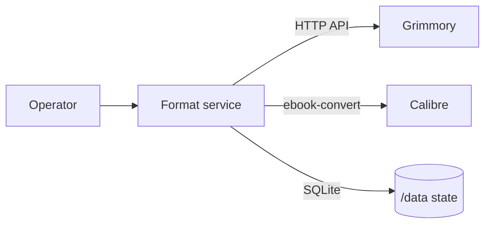

# Grimmory Format Automation

A single-replica Go service for reconciling ebook formats in Grimmory. Grimmory
is the source of truth; the service uses its HTTP API, Calibre
`ebook-convert`, and SQLite state under `/data`.

## Architecture



## Installation

### Docker Compose: manual

Set the required `GRIMMORY_BASE_URL`, `GRIMMORY_USERNAME`,
`GRIMMORY_PASSWORD`, and `LIBRARY_IDS` variables, then run:

```sh
docker compose up --build
```

### Docker Compose: polling

Use the same required variables and run:

```sh
docker compose -f docker-compose.poll.yml up -d --build
```

### Direct local Go/Calibre run

From `converter`, install Go and Calibre with `ebook-convert` available on
`PATH`, set the required variables, then run either:

```sh
go run ./cmd/server
go run ./cmd/server --poll
```

The second command enables polling.

## Usage

### Health and routes

```sh
curl --fail http://127.0.0.1:8080/health
```

`GET /health` requires no authentication. The other routes require
`Authorization: Bearer <API_KEY>`:

| Method | Route | Query |
| --- | --- | --- |
| `GET` | `/formats` | — |
| `POST` | `/sync/{libraryId}/{bookId}` | optional `dryRun=true\|false`, `force=true\|false` |

### Retrieve the generated key

When `API_KEY` is unset or blank, retrieve the generated key with:

```sh
docker compose exec -T grimmory-format-service cat /data/api-key
```

### Manual sync

```sh
curl --fail-with-body -X POST \
  'http://127.0.0.1:8080/sync/LIBRARY_ID/BOOK_ID?dryRun=false&force=false' \
  -H "Authorization: Bearer ${API_KEY}"
```

### Polling

Polling starts an immediate scan and then scans at `POLL_INTERVAL`. It performs
real Grimmory writes; use the manual route with `dryRun=true` to inspect a
sync without writes.

> Safety: preserve `/data`; the generated key is a secret; polling writes to
> Grimmory; existing derivatives are not overwritten. Verify Grimmory OpenAPI
> before enabling writes.

## Configuration

| Variable | Default | Constraints |
| --- | --- | --- |
| `API_KEY` | generated | Non-empty value overrides the generated key; otherwise load or create `/data/api-key`. |
| `PORT` | `8080` | Decimal integer `0`–`65535`. |
| `ADDR` | `:${PORT}` | HTTP listen address. |
| `DATA_DIR` | `/data` | Writable state and key directory. |
| `CALIBRE_BINARY` | `ebook-convert` | Executable name or path. |
| `LOG_LEVEL` | `info` | `debug`, `info`, `warn`, `warning`, or `error`. |
| `GRIMMORY_BASE_URL` | required | Absolute `http` or `https` URL without userinfo, query, or fragment. |
| `GRIMMORY_USERNAME` | required | Non-empty Grimmory account name. |
| `GRIMMORY_PASSWORD` | required | Non-empty Grimmory credential. |
| `LIBRARY_IDS` | required | Comma-separated unsigned decimal library IDs. |
| `OUTPUT_FORMATS` | `mobi,azw3` | Non-empty comma/whitespace-separated format tokens; normalized lowercase; 1–32 characters. |
| `SUPPORTED_INPUT_FORMATS` | `epub,azw3,mobi` | Non-empty comma/whitespace-separated format tokens; normalized lowercase; 1–32 characters. |
| `IGNORE_PROCESSING_TAG` | disabled | Exact tag to skip when non-blank. |
| `FAILED_PROCESSING_TAG` | disabled | Exact tag for exhausted polling failures when non-blank. |
| `MAX_CONCURRENT_BOOKS` | `1` | Integer `1`–`16`. |
| `MAX_FILE_BYTES` | `100 MiB` | Integer `1` byte–`2 GiB`. |
| `MAX_RESPONSE_BYTES` | `8 MiB` | Integer `1` byte–`64 MiB`. |
| `HTTP_TIMEOUT` | `30s` | Go duration `1ms`–`10m`. |
| `CONVERSION_TIMEOUT` | `10m` | Go duration `1ms`–`2h`. |
| `DATABASE_BUSY_TIMEOUT` | `5s` | Go duration `0`–`1m`. |
| `POLL_INTERVAL` | `5m` | Go duration `1ms`–`24h`. |
| `POLL_MAX_ATTEMPTS` | `5` | Integer `1`–`1000`. |
| `POLL_RETRY_BASE` | `30s` | Go duration `1ms`–`24h`; not greater than `POLL_RETRY_MAX`. |
| `POLL_RETRY_MAX` | `15m` | Go duration `1ms`–`168h`; not less than `POLL_RETRY_BASE`. |
