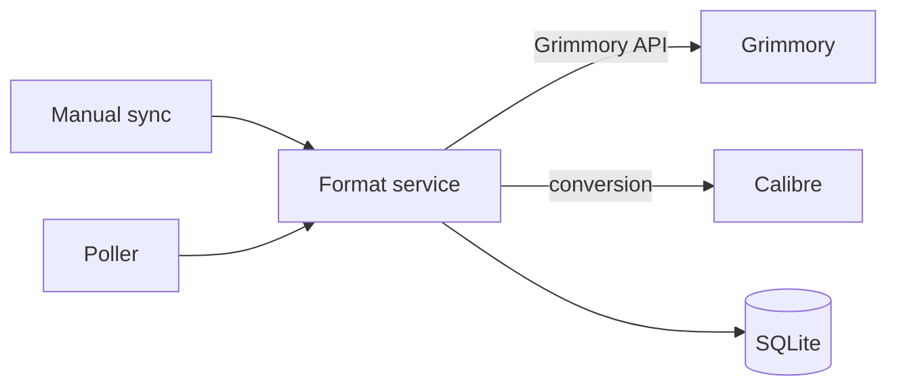

# Grimmory Format Automation

This Go service reconciles ebook formats in Grimmory and uses one replica.
Grimmory is the source of truth. The service uses Grimmory's HTTP API, Calibre
`ebook-convert`, and SQLite state in `/data`.

## Architecture



## How it works

- The service reads the Grimmory library `formatPriority`. It uses the first entry as the main format.
- It creates only missing formats that `OUTPUT_FORMATS` requests and the library policy allows.
- If the main file is missing, the service uses the first supported fallback in the remaining priority order.
- It converts that file into the missing main format and verifies the upload.
- If no supported fallback exists, the sync stops with `no_source`.
- `OUTPUT_FORMATS` lists derived formats, not the main format. The service removes any entry that matches the selected main format.
- The default `mobi,azw3` list therefore excludes the selected main format when it appears. Grimmory's library policy selects the main format, and `OUTPUT_FORMATS` requests additional derivatives.

## Installation

Docker Compose polling is the default.

- Save this file as `docker-compose.yml`.
- Replace the placeholder values.

```yaml
services:
  grimmory-format-service:
    image: ghcr.io/dawidgora/grimmory-format-automation:latest
    # Remove `command: ["--poll"]` for manual-only operation.
    command: ["--poll"]
    ports:
      - "8080:8080"
    volumes:
      - converter_data:/data
    environment:
      GRIMMORY_BASE_URL: "https://grimmory.example.invalid"
      GRIMMORY_USERNAME: "format-service"
      GRIMMORY_PASSWORD: "replace-with-grimmory-password"
      LIBRARY_IDS: "1,2"
      # API_KEY: "replace-with-service-key"
      OUTPUT_FORMATS: "mobi,azw3"
      SUPPORTED_INPUT_FORMATS: "epub,azw3,mobi"
      POLL_INTERVAL: "5m"

volumes:
  converter_data:
```

- Start the service:

  ```sh
  docker compose up -d --build
  ```

## Usage

### Health and routes

Check service health:

```sh
curl --fail http://127.0.0.1:8080/health
```

`GET /health` requires no authentication. All other routes require
`Authorization: Bearer <API_KEY>`:

| Method | Route | Query |
| --- | --- | --- |
| `GET` | `/formats` | — |
| `POST` | `/sync/{libraryId}/{bookId}` | optional `dryRun=true\|false`, `force=true\|false` |

### Retrieve the generated key

When `API_KEY` is unset or blank, retrieve the generated key:

```sh
docker compose exec -T grimmory-format-service cat /data/api-key
```

### Manual sync

Run one manual sync:

```sh
curl --fail-with-body -X POST \
  'http://127.0.0.1:8080/sync/LIBRARY_ID/BOOK_ID?dryRun=false&force=false' \
  -H "Authorization: Bearer ${API_KEY}"
```

The Compose example enables polling. Polling writes to Grimmory. Use
`dryRun=true` only for manual syncs.

## Configuration

| Variable | Default | Description |
| --- | --- | --- |
| `API_KEY` | generated | Set a non-empty value to override the generated key. Otherwise, the service loads or creates `/data/api-key`. |
| `PORT` | `8080` | HTTP port: `0`–`65535`. |
| `ADDR` | `:${PORT}` | HTTP listen address. |
| `DATA_DIR` | `/data` | Directory for SQLite state and the generated key. |
| `CALIBRE_BINARY` | `ebook-convert` | Executable name or path for Calibre. |
| `LOG_LEVEL` | `info` | Use `debug`, `info`, `warn`, `warning`, or `error`. |
| `GRIMMORY_BASE_URL` | required | Required absolute `http` or `https` URL for Grimmory. |
| `GRIMMORY_USERNAME` | required | Required Grimmory account name. |
| `GRIMMORY_PASSWORD` | required | Required Grimmory credential. |
| `LIBRARY_IDS` | required | Required comma-separated list of library IDs. |
| `OUTPUT_FORMATS` | `mobi,azw3` | Non-empty output format list. Separate values with commas or whitespace. Each format can use up to 32 characters. |
| `SUPPORTED_INPUT_FORMATS` | `epub,azw3,mobi` | Non-empty input format list. Separate values with commas or whitespace. Each format can use up to 32 characters. |
| `IGNORE_PROCESSING_TAG` | disabled | Tag to skip. A blank value disables it. |
| `FAILED_PROCESSING_TAG` | disabled | Tag for polling failures after all attempts. A blank value disables it. |
| `MAX_CONCURRENT_BOOKS` | `1` | Concurrent book syncs: `1`–`16`. |
| `MAX_FILE_BYTES` | `100 MiB` | Input file limit: `1` byte–`2 GiB`. |
| `MAX_RESPONSE_BYTES` | `8 MiB` | HTTP response limit: `1` byte–`64 MiB`. |
| `HTTP_TIMEOUT` | `30s` | HTTP timeout: `1ms`–`10m` Go duration. |
| `CONVERSION_TIMEOUT` | `10m` | Calibre timeout: `1ms`–`2h` Go duration. |
| `DATABASE_BUSY_TIMEOUT` | `5s` | SQLite busy wait: `0`–`1m` Go duration. |
| `POLL_INTERVAL` | `5m` | Poll interval: `1ms`–`24h` Go duration. |
| `POLL_MAX_ATTEMPTS` | `5` | Poll attempts per book: `1`–`1000`. |
| `POLL_RETRY_BASE` | `30s` | Initial retry delay: `1ms`–`24h`; it must not exceed `POLL_RETRY_MAX`. |
| `POLL_RETRY_MAX` | `15m` | Maximum retry delay: `1ms`–`168h`; it must not be below `POLL_RETRY_BASE`. |
