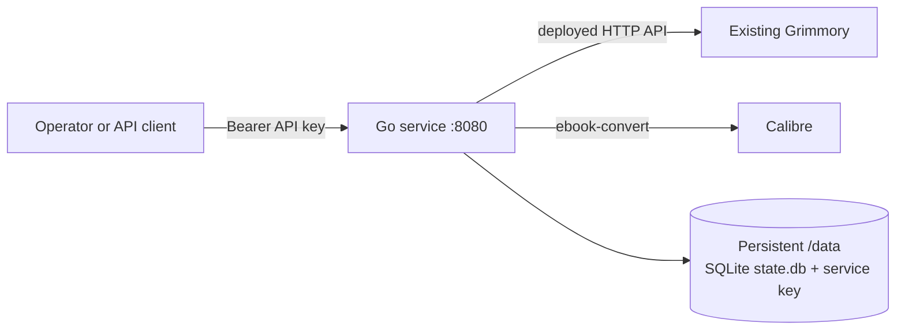

# Grimmory Format Automation

Grimmory Format Automation is a standalone, one-service Go application for
manually reconciling ebook formats in an existing Grimmory installation. It
uses Calibre for conversion and SQLite for durable reconciliation state.
Grimmory remains the source of truth and is reached over its HTTP API. The
service does not install Grimmory, contain its database, or use a `/books`
directory.

## Architecture



There is one application process. `/data` is the only persistent application
path; it contains the generated service key and SQLite state, not a Grimmory
library. Run one replica for a shared SQLite database and deterministic writes.

## Service API

| Method | Path | Authentication | Purpose |
| --- | --- | --- | --- |
| `GET` | `/health` | none | liveness/readiness |
| `GET` | `/formats` | bearer service key | supported formats |
| `POST` | `/sync/{libraryId}/{bookId}` | bearer service key | reconcile one Grimmory book |

`/sync/{libraryId}/{bookId}` accepts optional `dryRun=true` and `force=true`
query parameters. `libraryId` must be in the configured integer allowlist.
The library's `formatPriority` selects the main format for this operation;
fallbacks and outputs are then intersected with service and library policy.
The optional `--poll` CLI flag also runs a background library scan while these
endpoints remain available.

## Manual sync

Start the local Air development service and obtain its key. The default Compose
workflow is non-polling; it keeps the Go source mounted and reloads it when Go
files change:

```sh
# Provide these three values from a local ignored environment or a secret
# manager before starting Compose; they are required for Grimmory sync.
export GRIMMORY_BASE_URL='https://grimmory.example.invalid'
export GRIMMORY_USERNAME='service-account'
export GRIMMORY_PASSWORD='read-write-secret'
export LIBRARY_IDS='1,2'
docker compose up --build
```

In another terminal, obtain the generated key:

```sh
SERVICE_URL=http://127.0.0.1:8080
API_KEY="$(docker compose exec -T grimmory-format-service cat /data/api-key)"
```

If `API_KEY` is explicitly configured, use that value
instead of reading the generated key. Submit one book and the requested
derived formats with curl:

```sh
curl --fail-with-body -X POST "${SERVICE_URL}/sync/LIBRARY_ID/BOOK_ID?dryRun=false&force=false" \
  -H "Authorization: Bearer ${API_KEY}"
```

The same request with HTTPie is:

```sh
http POST "${SERVICE_URL}/sync/LIBRARY_ID/BOOK_ID?dryRun=false&force=false" \
  "Authorization:Bearer ${API_KEY}"
```

The service key is separate from any Grimmory credential. With no explicit
key, the service generates a random key once and stores it as
`/data/api-key` with mode `0600`. Keep the `/data` volume/PVC across upgrades;
losing it loses a generated key and requires a key rotation. An explicit
`API_KEY` is not written to the volume. Treat it as a password: inject it through an ignored local
environment or a secret manager, never commit it, print it in CI, or put it in
logs. Rotate an explicit key by replacing the secret and restarting the
service; rotate a generated key by setting a new explicit key before restart.

The sync process also needs the target Grimmory URL and least-privilege API
credentials. Supply those through the configuration mechanism documented by
the current Go server and a runtime Secret; never put them in the image or the
sync request. The examples intentionally contain no credential values.

## Configuration policy

Only service configuration is accepted. There is no library-path setting and
`/data` is the deployment location for state. Set one spelling of each alias;
do not configure both forms at once.

| Variable | Default | Constraint |
| --- | --- | --- |
| `API_KEY` | generated | non-empty value overrides generated key |
| `CONVERTER_DATA_DIR` / `DATA_DIR` | `/data` | writable service-data directory; use `/data` in containers |
| `CONVERTER_PORT` / `PORT` | `8080` | decimal `0`–`65535`; use `8080` for deployments |
| `CONVERTER_CALIBRE_BINARY` / `CALIBRE_BINARY` | `ebook-convert` | executable path/name, not a shell command |
| `CONVERTER_LOG_LEVEL` / `LOG_LEVEL` | `info` | one of `debug`, `info`, `warn`, `error` |
| `GRIMMORY_BASE_URL` | none | required absolute `http` or `https` URL |
| `GRIMMORY_USERNAME` | none | required non-empty Grimmory account name |
| `GRIMMORY_PASSWORD` | none | required non-empty secret; inject at runtime |
| `LIBRARY_IDS` | none | required comma-separated non-negative integer allowlist |
| `OUTPUT_FORMATS` | `mobi,azw3` | non-empty comma/space-separated format tokens |
| `SUPPORTED_INPUT_FORMATS` | `epub,mobi,azw3` | non-empty comma/space-separated format tokens |
| `IGNORE_PROCESSING_TAG` | disabled | skip books carrying this exact tag when non-empty |
| `FAILED_PROCESSING_TAG` | disabled | tag poll failures after retries are exhausted when non-empty |
| `MAX_CONCURRENT_BOOKS` | `1` | integer from `1` through `16`; shared by manual and poll syncs |
| `MAX_FILE_BYTES` | `100 MiB` | integer from `1` byte through `2 GiB` |
| `MAX_RESPONSE_BYTES` | `8 MiB` | integer from `1` byte through `64 MiB` |
| `HTTP_TIMEOUT` | `30s` | `1ms` through `10m` Go duration |
| `CONVERSION_TIMEOUT` | `10m` | `1ms` through `2h` Go duration |
| `DATABASE_BUSY_TIMEOUT` | `5s` | `0` through `1m` Go duration |
| `POLL_INTERVAL` | `5m` | `1ms` through `24h`; Go duration syntax such as `30s`, `5m`, or `1h` |
| `POLL_MAX_ATTEMPTS` | `5` | integer from `1` through `1000` |
| `POLL_RETRY_BASE` | `30s` | `1ms` through `24h` Go duration |
| `POLL_RETRY_MAX` | `15m` | `1ms` through `168h`, not below `POLL_RETRY_BASE` |

Do not pass credentials on command lines where the process list can expose
them. Use HTTPS for Grimmory outside a trusted local network, and put the
service behind an authenticated TLS proxy when it is reachable beyond the
private deployment network.

`POLL_INTERVAL` accepts Go duration syntax, for example `30s`, `5m`, or `1h`.
Polling schedules scans start-to-start: the interval is measured from one scan
start to the next, and any tick received while a scan is running is skipped.

## Reconciliation algorithm and state

Each request is a single-book reconciliation. The deterministic policy is:

1. Validate the library and book reference, read that library's immutable
   policy, and select `formatPriority[0]` as main. Fallbacks are the remaining
   priority entries intersected with `SUPPORTED_INPUT_FORMATS`; outputs are
   `OUTPUT_FORMATS` intersected with `allowedFormats`. A null or empty
   `allowedFormats` means unrestricted. The main format must be supported and
   allowed.
2. Read the scoped book metadata and file inventory from Grimmory's deployed
   API. If the main format is absent, select the first available fallback; if
   none exists, stop with `no_source`.
   Never discover input by walking a local directory.
3. Download the canonical source (or download and first convert the selected
   fallback source when the canonical file is missing) and compute the
   canonical SHA-256. For each configured output, plan `create` when missing,
   `rebuild` when forced, when the canonical source was just created, when the
   saved source hash differs, state is absent or incomplete, or when both
   canonical and target mtimes are trusted and the target is older. A matching
   fully tracked target is `unchanged`. `dryRun` returns
   this plan without writing; `force` is the explicit overwrite override.
4. For every planned output, invoke Calibre in a private temporary directory,
   hash and size-check the result, and upload only a complete validated file.
   Never delete the source. When creating a missing main from a configured
   output format, that existing output is rebuilt from the new canonical main.
5. Verify each upload by reading Grimmory again and confirming the requested
   format exists and changed identity or matching remote hash proves the upload.
   Only then commit the source SHA-256, output SHA-256, target
   format, trusted modification time, and timestamp. Conversion, download,
   upload, verification, and state failures are reported per item; a request
   with any derivative failure is `partial`, and partial output is never marked
   current.

The state database is `/data/state.db`, opened with the pure-Go
`modernc.org/sqlite` driver. It uses `PRAGMA journal_mode=WAL`, foreign-key
checks, a single database connection, and a busy timeout. It has three tables:
`book_state` is keyed by `(library_id, book_id)` and stores `main_format`,
`canonical_format`, canonical file ID/name, `canonical_sha256`, metadata
fingerprint, an optional trusted canonical mtime, last-success timestamp, and
`updated_at_ns`; `derived` is keyed by `(library_id, book_id, format)` and stores the
uploaded Grimmory file ID, `source_sha256`, `output_sha256`, an optional
target-aware generation fingerprint, optional trusted target mtime, generation
timestamp, and `updated_at_ns`. Derived rows are retained when the canonical source changes
or a later operation fails, so the previous evidence is not discarded. A
transaction records a derived row only after the post-upload read confirms the
requested target. SQLite state is not a substitute for multi-replica
distributed locking; the service is therefore deployed with one replica.

With `--poll`, the service lists each configured library through its library
endpoint, gets each book's scoped detail, and persists its stable observation.
Only pending or due retry observations are sent through the same scoped `Sync`
path using a fixed worker pool. Managed ignore/failure tags are excluded from
observation fingerprints, so tags never change retry attempt semantics. A
successful sync is followed by another live book read before the observation
is marked applied/current. Retries use capped exponential jitter and are
limited to transient network/timeouts, remote `408`/`425`/`429`/`5xx`, SQLite
busy/locked, and eventual upload-visibility failures. There is deliberately
no byte-only source change detection: a source byte change with no observable
Grimmory API change is not discoverable by polling.

## Grimmory API contract warning

The algorithm above uses this **explicit assumption** for the write step:
`POST /api/v1/books/{bookId}/files`, with the upload fields and response
described by the deployment. That path is an assumption for the integration,
not a claim about Grimmory's current public contract. Grimmory releases and
installations can use different paths, authentication, multipart field names,
version fields, or conflict behavior.

Before enabling writes, fetch the target deployment's `GET /api/openapi.json`
and verify the actual servers, security scheme, book/file read operations,
source download, upload operation, request schema, response schema, and
conflict semantics. If the deployed document does not describe the assumed
operation, stop and configure the adapter for the documented contract; do not
guess from this repository or a different Grimmory release.

Metadata is deliberately limited: Grimmory metadata remains authoritative, but
the service does not promise to preserve every custom field, series value,
cover, or embedded metadata detail through Calibre. The integration tracks
file identity and format state, not a metadata migration. Review a converted
book and its metadata before broad use.

## Deployment

### Docker Compose

Compose runs only `grimmory-format-service` and publishes port `8080`.

The default workflow is Air-based, non-polling development with isolated
`converter_dev_data` state:

```sh
docker compose up --build
```

In another terminal, check that the service is ready:

```sh
curl --fail http://127.0.0.1:8080/health
```

For production-style polling, use the standalone Compose file. It invokes the
binary entrypoint with `--poll` and keeps the service key and SQLite state in
the persistent `converter_data` volume; it does not merge with the development
file:

```sh
docker compose -f docker-compose.poll.yml up -d --build
```

Polling performs real reconciliation writes for due books. Verify the target
Grimmory API contract and credentials before starting it. To inspect behavior
without writes, use the manual endpoint's `dryRun=true`; the polling workflow
itself is not a dry-run mode.

The development image is built with the pinned Air tool, mounts `converter/`,
and rebuilds/restarts the server when Go files change. Re-run the command after
changing `go.mod` or `go.sum` so the development image refreshes its module
cache.

Do not publish the service directly to an untrusted network. Set an explicit
`API_KEY` through a local ignored environment or use the generated
key retrieval shown above. Configure the target Grimmory URL and credential
with runtime secret injection appropriate to the sync server.

### Kubernetes

The manifests in [`kubernetes/`](kubernetes/) are examples for the same single
service: one Deployment, ClusterIP Service, `/data` PVC, and example Secret.
Replace the image owner, pin an immutable image tag, select a StorageClass, and
use an external or sealed Secret in production.

```sh
kubectl create namespace grimmory-automation --dry-run=client -o yaml | kubectl apply -f -
kubectl -n grimmory-automation apply -f kubernetes/secret.example.yaml
kubectl -n grimmory-automation apply -f kubernetes/pvc-example.yaml
kubectl -n grimmory-automation apply -f kubernetes/service.yaml
kubectl -n grimmory-automation apply -f kubernetes/deployment.yaml
```

The Service is internal by default. Add an authenticated HTTPS gateway only
after applying network policy and secret management appropriate to the cluster.

## Scope and exclusions

- Polling is opt-in at the binary CLI; its fixed worker pool and manual HTTP
  sync share the `MAX_CONCURRENT_BOOKS` limiter.
- Supported formats are EPUB input and MOBI/AZW3 derived output. PDF and KFX
  are excluded, and DRM is never bypassed.
- The project does not provide a Grimmory server, database, library backup,
  metadata migration, or an ingress/TLS certificate.
- Calibre conversion can be CPU- and storage-intensive. Test against a
  disposable collection or reversible staging process before production use.
- Keep backups of `/data` for state and generated-key recovery; ebook files are
  transient request data and are not an archival store.

## License and Calibre obligations

This project is released under the [MIT License](LICENSE). The runtime image
also distributes Debian's Calibre package, which is licensed under the GNU
GPLv3. When distributing the image, retain the applicable license notices and
provide the corresponding Calibre source or written offer as required by the
GPLv3. See the [Calibre project](https://github.com/kovidgoyal/calibre) and
Debian package notices for authoritative terms. Grimmory and ebook contents
remain separate works with their own licenses and usage rights.
