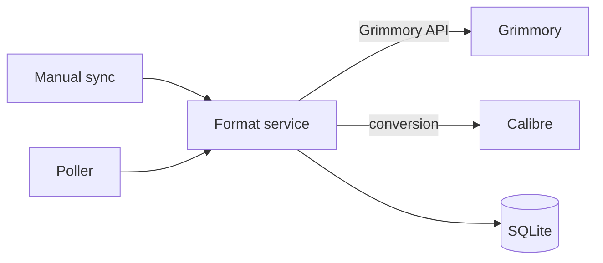

# Grimmory Format Automation

This Go service reconciles ebook formats in Grimmory and uses one replica.
Grimmory is the source of truth. The service uses Grimmory's HTTP API, Calibre
`ebook-convert`, and SQLite state in `/data`.

## Architecture


```mermaid
flowchart LR
    Manual[Manual sync] --> Service[Format service]
    Poller[Poller] --> Service
    Service -->|Grimmory API| Grimmory[Grimmory]
    Service -->|conversion| Calibre[Calibre]
    Service --> State[(SQLite)]
```

## How it works

- The service reads the Grimmory library `formatPriority`. It uses the first entry as the main format.
- It creates only missing formats that `OUTPUT_FORMATS` requests and the library policy allows.
- If the main file is missing, the service uses the first supported fallback in the remaining priority order.
- It converts that file into the missing main format and verifies the upload.
- If no supported fallback exists, the sync stops with `no_source`.
- `OUTPUT_FORMATS` lists derived formats, not the main format. The service removes any entry that matches the selected main format.
- The default `mobi,azw3` list therefore excludes the selected main format when it appears. Grimmory's library policy selects the main format, and `OUTPUT_FORMATS` requests additional derivatives.

### Existing derivatives

- Existing derivatives are preserved by default. The service first determines
  whether each configured derivative is stale; missing derivatives are created,
  while current derivatives are left unchanged.
- `EXISTING_DERIVATIVE_POLICY=replace` globally authorizes replacement only for
  derivatives the service has already found stale. It does not force current
  derivatives to rebuild.
- `force=true` on a sync explicitly rebuilds the configured derivatives for
  that request and authorizes destructive replacement of existing derivatives,
  including ones that are not stale.
- `DERIVATIVE_REPLACEMENT_TAG` is a per-book authorization for stale
  replacements while the policy is `preserve`. It is one-shot: the service
  removes the tag only after a successful sync actually replaces a stale
  derivative under that authorization. A sync that only creates missing
  derivatives, preserves current derivatives, or fails before replacement does
  not consume it. Wait for the service to remove the tag before adding the same
  tag again.
- Replacing an existing derivative is a delete-then-upload sequence and is not
  atomic. The service minimizes the gap and uses recovery handling, but an
  interruption or failure can leave the derivative absent.

## Installation

Docker Compose polling is the default.

- Save this file as `docker-compose.yml`.
- Replace the placeholder values.

```yaml
services:
  grimmory-format-service:
    image: ghcr.io/dawidgora/grimmory-format-automation:latest
    restart: unless-stopped
    stop_grace_period: 31m
    # Remove `command: ["--poll"]` for manual-only operation.
    command: ["--poll"]
    ports:
      - "8080:8080"
    volumes:
      - converter_data:/data
    environment:
      GRIMMORY_BASE_URL: "https://grimmory.example.invalid"
      GRIMMORY_USERNAME: "format-service"
      GRIMMORY_PASSWORD: "replace-with-grimmory-password"
      LIBRARY_IDS: "1"
      # API_KEY: "replace-with-service-key"
      OUTPUT_FORMATS: "mobi,azw3"
      SUPPORTED_INPUT_FORMATS: "epub,azw3,mobi"
      EXISTING_DERIVATIVE_POLICY: "preserve"
      DERIVATIVE_REPLACEMENT_TAG: "derivative-replacement"
      POLL_INTERVAL: "1m"

volumes:
  converter_data:
```

Both Compose files publish the API on the configured host port and allow 31
minutes for graceful shutdown. Adjust the host binding to choose network
exposure. This covers three sequential 10-minute conversions and 30 seconds for
HTTP shutdown.

- Start the service:

  ```sh
  docker compose up -d
  ```

## Usage

### Health and routes

Check service health:

```sh
curl --fail http://127.0.0.1:8080/health
```

`GET /health` requires no authentication. All other routes require
`Authorization: Bearer <API_KEY>`:

| Method | Route | Query |
| --- | --- | --- |
| `GET` | `/formats` | — |
| `POST` | `/sync/{libraryId}/{bookId}` | optional `dryRun=true\|false`, `force=true\|false` |

### Retrieve the generated key

When `API_KEY` is unset or blank, retrieve the generated key:

```sh
docker compose exec -T grimmory-format-service cat /data/api-key
```

### Manual sync

Run one manual sync:

```sh
curl --fail-with-body -X POST \
  'http://127.0.0.1:8080/sync/LIBRARY_ID/BOOK_ID?dryRun=false&force=false' \
  -H "Authorization: Bearer ${API_KEY}"
```

The Compose example enables polling. Polling writes to Grimmory. Use
`dryRun=true` only for manual syncs.

To explicitly rebuild configured derivatives for one request, use `force=true`:

```sh
curl --fail-with-body -X POST \
  'http://127.0.0.1:8080/sync/LIBRARY_ID/BOOK_ID?dryRun=false&force=true' \
  -H "Authorization: Bearer ${API_KEY}"
```

## Configuration

Use [Go duration strings](https://pkg.go.dev/time#ParseDuration) for intervals
and timeouts, such as `30s`, `1m`, or `1h`.

| Variable | Default | Description |
| --- | --- | --- |
| `API_KEY` | generated | Set a non-empty value to override the generated key. Otherwise, the service loads or creates `/data/api-key`. |
| `PORT` | `8080` | HTTP port: `0`–`65535`. |
| `ADDR` | `:${PORT}` | HTTP listen address. |
| `DATA_DIR` | `/data` | Directory for SQLite state and the generated key. |
| `CALIBRE_BINARY` | `ebook-convert` | Executable name or path for Calibre. |
| `LOG_LEVEL` | `info` | Use `debug`, `info`, `warn`, `warning`, or `error`. |
| `GRIMMORY_BASE_URL` | required | Accepts an absolute HTTP or HTTPS URL for Grimmory. |
| `GRIMMORY_USERNAME` | required | Required Grimmory account name. |
| `GRIMMORY_PASSWORD` | required | Required Grimmory credential. |
| `LIBRARY_IDS` | required | Required comma-separated list of library IDs. |
| `OUTPUT_FORMATS` | `mobi,azw3` | Non-empty output format list. Separate values with commas or whitespace. Each format can use up to 32 characters. |
| `SUPPORTED_INPUT_FORMATS` | `epub,azw3,mobi` | Non-empty input format list. Separate values with commas or whitespace. Each format can use up to 32 characters. |
| `EXISTING_DERIVATIVE_POLICY` | `preserve` | `preserve` keeps existing derivatives unless they are stale and an explicit authorization is supplied; `replace` globally authorizes replacement only for derivatives already found stale. |
| `DERIVATIVE_REPLACEMENT_TAG` | `derivative-replacement` | Per-book, one-shot authorization for stale replacement under `preserve`. It is removed only after a successful sync actually replaces a stale derivative under that authorization; wait for removal before re-adding it. |
| `IGNORE_PROCESSING_TAG` | disabled | Tag to skip. A blank value disables it. |
| `FAILED_PROCESSING_TAG` | disabled | Tag for polling failures after all attempts. A blank value disables it. |
| `MAX_CONCURRENT_BOOKS` | `1` | Concurrent book syncs: `1`–`16`. |
| `MAX_FILE_BYTES` | `100 MiB` | Input file limit: `1` byte–`2 GiB`. |
| `MAX_RESPONSE_BYTES` | `8 MiB` | HTTP response limit: `1` byte–`64 MiB`. |
| `HTTP_TIMEOUT` | `30s` | HTTP timeout: `1ms`–`10m`. |
| `CONVERSION_TIMEOUT` | `10m` | Calibre timeout: `1ms`–`2h`. |
| `DATABASE_BUSY_TIMEOUT` | `5s` | SQLite busy wait: `0`–`1m`. |
| `POLL_INTERVAL` | `5m` | Poll interval: `1ms`–`24h`. |
| `POLL_MAX_ATTEMPTS` | `5` | Poll attempts per book: `1`–`1000`. |
| `POLL_RETRY_BASE` | `30s` | Initial retry delay: `1ms`–`24h`; it must not exceed `POLL_RETRY_MAX`. |
| `POLL_RETRY_MAX` | `15m` | Maximum retry delay: `1ms`–`168h`; it must not be below `POLL_RETRY_BASE`. |

- `IGNORE_PROCESSING_TAG` and `FAILED_PROCESSING_TAG` must differ when both are
  non-empty. Identical values fail startup.
- `DERIVATIVE_REPLACEMENT_TAG` must differ from both processing tags.

Compatible examples:

```env
# Default: preserve existing derivatives and authorize a stale replacement per book.
EXISTING_DERIVATIVE_POLICY=preserve
DERIVATIVE_REPLACEMENT_TAG=derivative-replacement

# Alternative: globally authorize replacements after derivatives are found stale.
# EXISTING_DERIVATIVE_POLICY=replace
```
